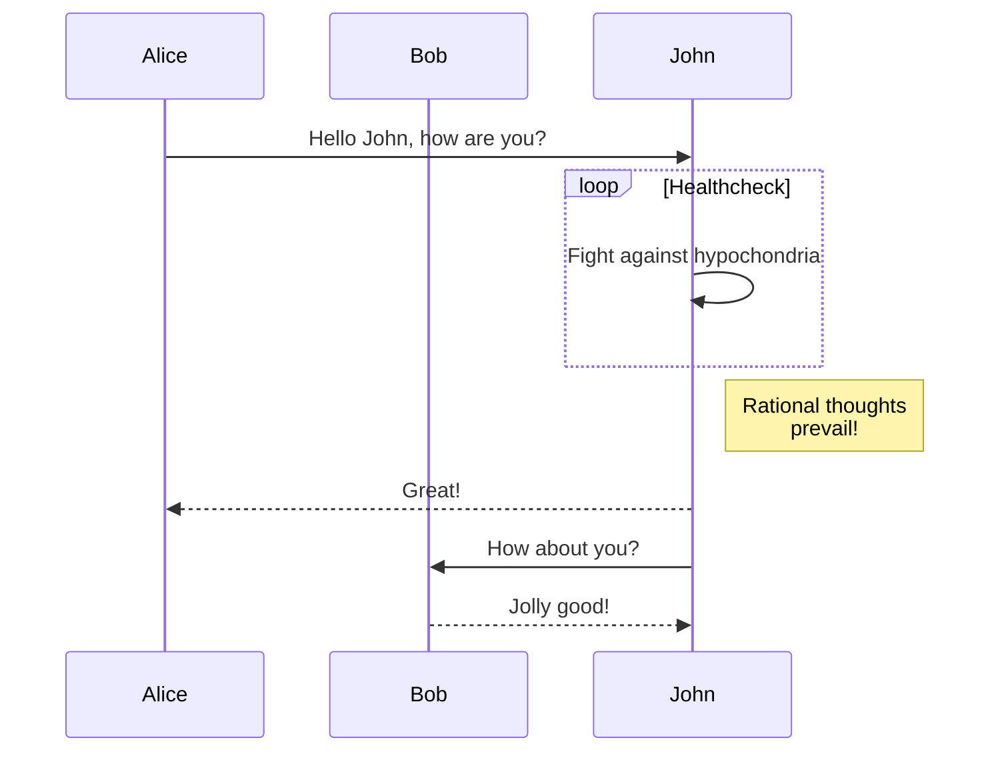

+++
title = "المكونات"
description = "كيفية استخدام المكونات"
date = 2022-10-20
updated = 2026-08-16
[taxonomies]
tags = ["markdown", "css", "html"]
authors = ["salif"]
[extra]
mermaid = true
+++

يوفر قالب لينكيتا العديد من المكونات.

لم تسمع عن المكونات من قبل؟ راجع [توثيق Zola](https://keats.github.io/tera/#components) لمزيد من المعلومات.

## مكون Mermaid

لاستخدام Mermaid في صفحتك، يجب عليك ضبط `extra.mermaid = true` في مقدمة الصفحة.

```toml
+++
title = "عنوان صفحتك"

[extra]
mermaid = true
+++
```

ثم يمكنك استخدام مكون `<mermaid>` مثل:

```markdown


graph TD;
A-->B;
A-->C;
B-->D;
C-->D;


```

سيتم عرض هذا على النحو التالي:



graph TD;
A-->B;
A-->C;
B-->D;
C-->D;



بالإضافة إلى ذلك، يمكنك استخدام كتلة التعليمات البرمجية داخل مكونات `<mermaid>` وسيتم تجاهل كتلة التعليمات البرمجية.

تمنع كتلة التعليمات البرمجية المنسق من كسر تنسيق Mermaid.

````markdown





````

سيتم عرض هذا على النحو التالي:






## التنبيهات

يعرض مكون `<admonition>` لافتة لمساعدتك في وضع ملاحظة في صفحتك.

يمكنك استخدام المكون مثل:

```markdown

تنبيه `tip`.

```

يحتوي مكون التنبيه على 12 نوعًا مختلفًا:


تنبيه `note`.



تنبيه `abstract`.



تنبيه `info`.



تنبيه `tip`.



تنبيه `success`.



تنبيه `question`.



تنبيه `warning`.



تنبيه `failure`.



تنبيه `danger`.



تنبيه `bug`.



تنبيه `example`.



تنبيه `quote`.


## معرض الصور

مكون `<gallery />` هو معرض صور بسيط قابل للنقر يعتمد على HTML فقط ويعرض جميع الصور من أصول الصفحة.

إنه من [توثيق Zola](https://www.getzola.org/documentation/content/image-processing/)

```markdown
{{ <gallery /> }}
```

{{ <gallery page config alt="صورة تجريبية لمعرض الصور" /> }}

## المشاريع

يتيح لك مكون `<projects />` إنشاء صفحة لمشاريعك.

أنشئ ملفًا باسم `content/pages/projects/index.md`:

```markdown
+++
title = "مشاريعي"
description = ""
path = "projects"
+++

{{ <projects path="data.toml" format="toml" page config /> }}
```

أنشئ ملفًا باسم `content/pages/projects/data.toml`:

```toml
[[project]]
name = "lorem"
desc = "Lorem ipsum dolor sit."
tags = ["lorem", "ipsum"]
links = [
    { name = "homepage", url = "https://example.com" },
    { name = "source", url = "https://example.com" },
]
```

سيتم عرض هذا كالتالي:

{{ <projects path="projects.toml" format="toml" page config /> }}
