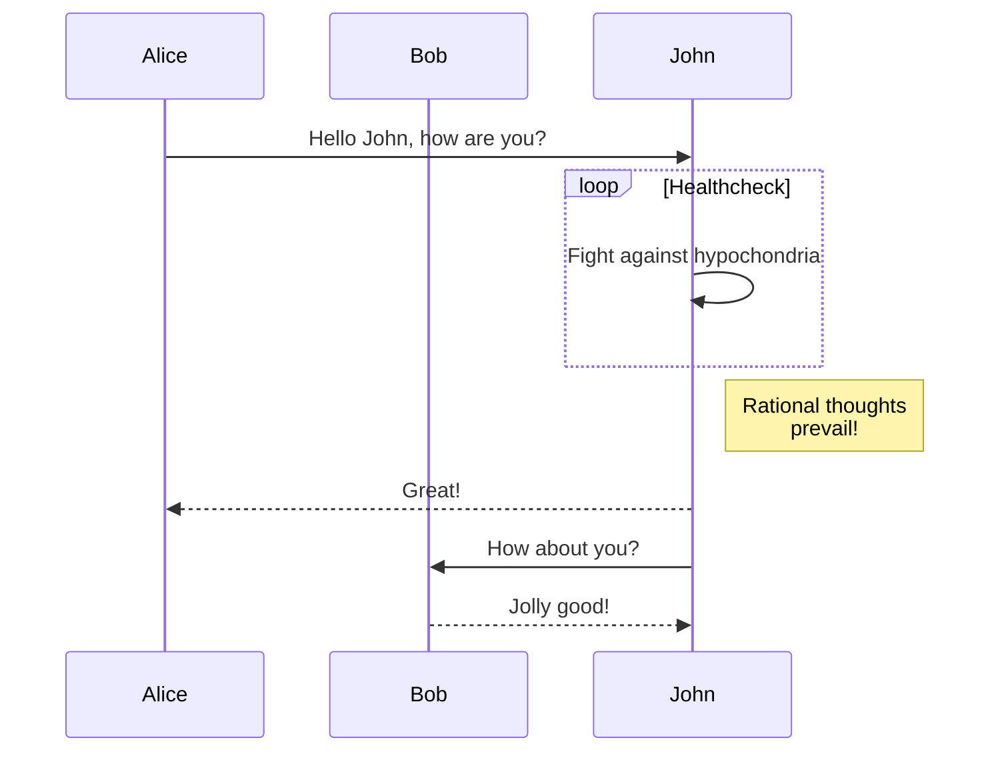

+++
title = "Компоненти"
description = "Как се използват компонентите"
date = 2022-10-20
updated = 2026-08-16
[taxonomies]
tags = ["маркдаун", "css", "html"]
authors = ["salif"]
[extra]
mermaid = true
+++

Темата Линкита предоставя множество компоненти.

Ако не сте чували за компоненти, вижте [документацията на Зола](https://keats.github.io/tera/#components) за повече информация.

## Mermaid диаграми

За да използвате Mermaid във вашата страница, трябва да зададете `extra.mermaid = true` в предните данни (frontmatter) на страницата.

```toml
+++
title = "Заглавие"

[extra]
mermaid = true
+++
```

След това можете да използвате компонента `<mermaid>` ето така:

```markdown


graph TD;
A-->B;
A-->C;
B-->D;
C-->D;


```

Това ще бъде изобразено така:



graph TD;
A-->B;
A-->C;
B-->D;
C-->D;



Освен това, можете да използвате блок с код вътре в компонентите и блокът с код ще бъде игнориран.

Блокът с код предотвратява форматирането на Mermaid от форматиращия инструмент.

````markdown





````

Това ще бъде изобразено така:






## Предупреждения

Компонентът `<admonition>` показва банер, който ви помага да поставите известие на вашата страница.

Можете да използвате компонента по този начин:

```markdown

Предупреждението `tip`.

```

Компонентът има 12 различни типа:


Предупреждението `note`.



Предупреждението `abstract`.



Предупреждението `info`.



Предупреждението `tip`.



Предупреждението `success`.



Предупреждението `question`.



Предупреждението `warning`.



Предупреждението `failure`.



Предупреждението `danger`.



Предупреждението `bug`.



Предупреждението `example`.



Предупреждението `quote`.


## Галерия

Компонентът `<gallery />` е много проста галерия с изображения, която показва всички изображения от „assets“ на страницата.

Взето е от [документацията на Зола](https://www.getzola.org/documentation/content/image-processing/)
```markdown
{{ <gallery /> }}
```

{{ <gallery page config alt="Демо изображение за галерията" /> }}

## Проекти

Компонентът `<projects />` ви позволява да създадете страница за вашите проекти.

Създайте файл `content/pages/projects/index.md`:

```markdown
+++
title = "Моите проекти"
description = ""
path = "projects"
+++

{{ <projects path="data.toml" format="toml" page config /> }}
```

Създайте файл `content/pages/projects/data.toml`:

```toml
[[project]]
name = "lorem"
desc = "Lorem ipsum dolor sit."
tags = ["lorem", "ipsum"]
links = [
    { name = "homepage", url = "https://example.com" },
    { name = "source", url = "https://example.com" },
]
```

Това ще бъде показано така:

{{ <projects path="projects.toml" format="toml" page config /> }}
