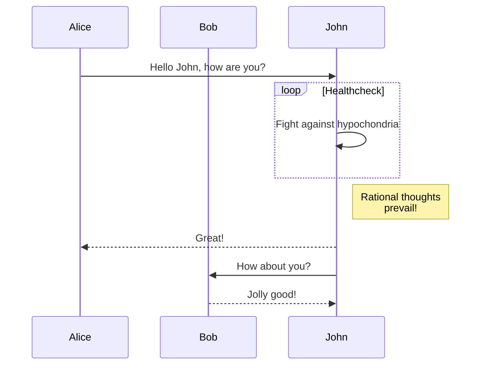

+++
title = "Komponenty"
description = "Jak používat komponenty"
date = 2022-10-20
updated = 2026-08-16
[taxonomies]
tags = ["markdown", "css", "html"]
authors = ["salif"]
[extra]
mermaid = true
+++

Šablona Linkita poskytuje několik komponent.

Nikdy jste o komponentách neslyšeli? Více informací naleznete v [dokumentaci Zoly](https://keats.github.io/tera/#components).

## Mermaid komponenta

Chcete-li na své stránce použít Mermaid, musíte v její frontmatter části nastavit `extra.mermaid = true`.

```toml
+++
title = "Titulek vaší stránky"

[extra]
mermaid = true
+++
```

Poté můžete komponentu `<mermaid>` použít takto:

```markdown


graph TD;
A-->B;
A-->C;
B-->D;
C-->D;


```

Toto bude vykresleno jako:



graph TD;
A-->B;
A-->C;
B-->D;
C-->D;



Kromě toho můžete uvnitř komponenty `<mermaid>` použít blok kódu, který bude ignorován.

Blok kódu zabraňuje formátovači, aby rozbil formátování diagramu Mermaid.

````markdown





````

Toto bude vykresleno jako:






## Poznámky

Komponenta `<admonition>` zobrazí banner, který vám pomůže umístit na stránku upozornění.

Komponentu můžete použít takto:

```markdown

`tip` poznámka.

```

Komponenta pro poznámky má 12 různých typů:


`note` poznámka.



`abstract` poznámka.



`info` poznámka.



`tip` poznámka.



`success` poznámka.



`question` poznámka.



`warning` poznámka.



`failure` poznámka.



`danger` poznámka.



`bug` poznámka.



`example` poznámka.



`quote` poznámka.


## Galerie

Komponenta `<gallery />` je velmi jednoduchá, klikatelná obrázková galerie (pouze HTML), která zobrazuje všechny obrázky z prostředků stránky (page assets).

Pochází z [dokumentace Zoly](https://www.getzola.org/documentation/content/image-processing/)

```markdown
{{ <gallery /> }}
```

{{ <gallery page config alt="Ukázkový obrázek pro galerii" /> }}

## Projekty

Komponenta `<projects />` vám umožní vytvořit stránku pro vaše projekty.

Vytvořte soubor `content/pages/projects/index.md`:

```markdown
+++
title = "Moje projekty"
description = ""
path = "projects"
+++

{{ <projects path="data.toml" format="toml" page config /> }}
```

Vytvořte soubor `content/pages/projects/data.toml`:

```toml
[[project]]
name = "lorem"
desc = "Lorem ipsum dolor sit."
tags = ["lorem", "ipsum"]
links = [
    { name = "homepage", url = "https://example.com" },
    { name = "source", url = "https://example.com" },
]
```

Toto bude zobrazeno jako:

{{ <projects path="projects.toml" format="toml" page config /> }}
