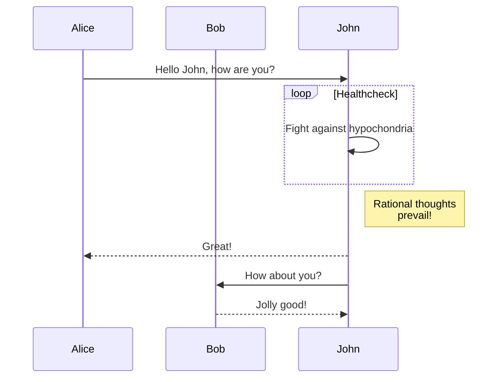

+++
title = "Komponentoj"
description = "Kiel uzi la komponentojn"
date = 2022-10-20
updated = 2026-08-16
[taxonomies]
tags = ["markdown", "css", "html"]
authors = ["salif"]
[extra]
mermaid = true
+++

La temo Linkita provizas plurajn komponentojn.

Ĉu vi neniam aŭdis pri komponentoj? Vidu la [dokumentaron de Zola](https://keats.github.io/tera/#components) por pli da informoj.

## Mermaid-komponento

Por uzi Mermaid en via paĝo, vi devas agordi `extra.mermaid = true` en la antaŭaĵo (frontmatter) de la paĝo.

```toml
+++
title = "Titolo"

[extra]
mermaid = true
+++
```

Tiam vi povas uzi la komponenton `<mermaid>` jene:

```markdown


graph TD;
A-->B;
A-->C;
B-->D;
C-->D;


```

Ĉi tio estos montrata tiel:



graph TD;
A-->B;
A-->C;
B-->D;
C-->D;



Krome, vi povas uzi kodblokon ene de la komponentoj `<mermaid>` kaj la kodbloko estos ignorata.

La kodbloko malhelpas ke la formatilo rompu la formatadon de Mermaid.

````markdown





````

Ĉi tio estos montrata tiel:






## Admono

La komponento `<admonition>` montras rubandon por helpi vin meti atentigon en vian paĝon.

Vi povas uzi la komponenton jene:

```markdown

La admono `konsileto`.

```

La komponento de admono havas 12 diversajn tipojn:


La admono `noto`.



La admono `resumo`.



La admono `informo`.



La admono `konsileto`.



La admono `sukceso`.



La admono `demando`.



La admono `averto`.



La admono `malsukceso`.



La admono `danĝero`.



La admono `cimo`.



La admono `ekzemplo`.



La admono `citaĵo`.


## Galerio

La komponento `<gallery />` estas tre simpla nur-HTML-a klakebla bildgalerio, kiu montras ĉiujn bildojn el la paĝaj aktivaĵoj (assets).

Ĝi estas el la [dokumentaro de Zola](https://www.getzola.org/documentation/content/image-processing/)

```markdown
{{ <gallery /> }}
```

{{ <gallery page config alt="Demobildo por la galerio" /> }}

## Projektoj

La komponento `<projects />` ebligas al vi krei paĝon por viaj projektoj.

Kreu dosieron `content/pages/projects/index.md`:

```markdown
+++
title = "Miaj Projektoj"
description = ""
path = "projects"
+++

{{ <projects path="data.toml" format="toml" page config /> }}
```

Kreu dosieron `content/pages/projects/data.toml`:

```toml
[[project]]
name = "lorem"
desc = "Lorem ipsum dolor sit."
tags = ["lorem", "ipsum"]
links = [
    { name = "homepage", url = "https://example.com" },
    { name = "source", url = "https://example.com" },
]
```

Ĉi tio estos montrata jene:

{{ <projects path="projects.toml" format="toml" page config /> }}
