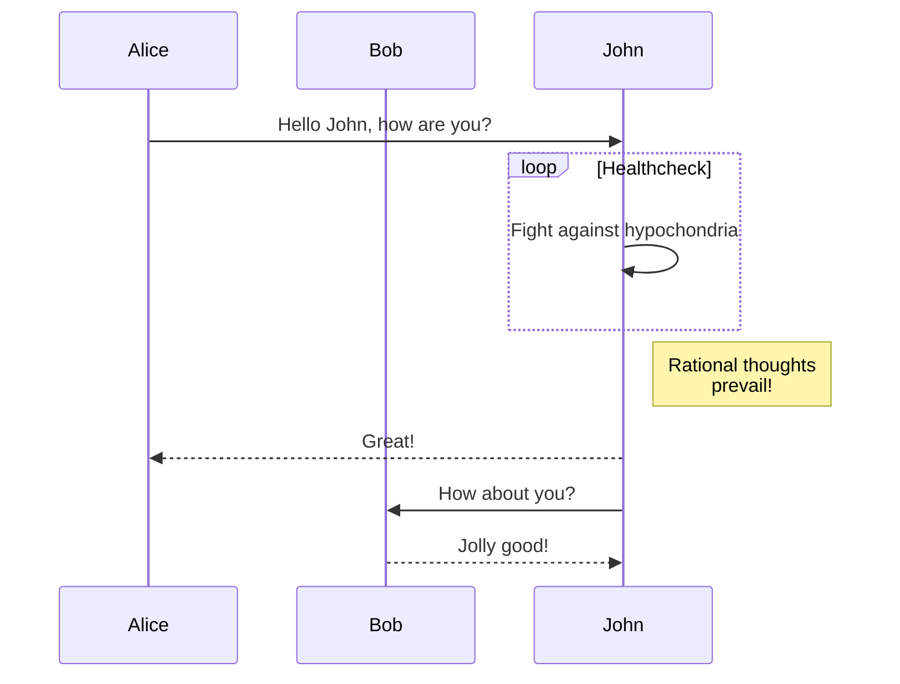

+++
title = "مولفه‌ها"
description = "نحوه استفاده از مولفه‌ها"
date = 2026-09-13
[taxonomies]
tags = ["components"]
authors = ["salif"]
[extra]
mermaid = true
+++

پوسته لینکیتا چندین مولفه در اختیارتان قرار می‌دهد.

آیا تا به حال درباره مولفه‌ها نشنیده‌اید؟ برای اطلاعات بیشتر [مستندات زولا](https://keats.github.io/tera/#components) را ببینید.

## مولفه Mermaid

برای استفاده از Mermaid در صفحه خود، باید `extra.mermaid = true` را در فرانت‌متر (frontmatter) صفحه تنظیم کنید.

```toml
+++
title = "عنوان صفحه شما"

[extra]
mermaid = true
+++
```

سپس می‌توانید از مولفه `<mermaid>` به این شکل استفاده کنید:

```markdown


graph TD;
A-->B;
A-->C;
B-->D;
C-->D;


```

این به شکل زیر نمایش داده می‌شود:



graph TD;
A-->B;
A-->C;
B-->D;
C-->D;



علاوه بر این، می‌توانید از بلوک کد در داخل مولفه‌های `<mermaid>` استفاده کنید و این بلوک کد نادیده گرفته خواهد شد.

بلوک کد مانع از به هم ریختن قالب‌بندی Mermaid توسط فرمت‌کننده‌ها (formatter) می‌شود.

````markdown





````

این به شکل زیر نمایش داده می‌شود:






## اعلان‌ها (Admonition)

مولفه `<admonition>` بنری را نمایش می‌دهد تا به شما در قرار دادن پیام‌ها و نکات توجه در صفحه‌تان کمک کند.

می‌توانید از این مولفه مانند زیر استفاده کنید:

```markdown

اعلان `tip`.

```

مولفه اعلان ۱۲ نوع مختلف دارد:


اعلان `note`.



اعلان `abstract`.



اعلان `info`.



اعلان `tip`.



اعلان `success`.



اعلان `question`.



اعلان `warning`.



اعلان `failure`.



اعلان `danger`.



اعلان `bug`.



اعلان `example`.



اعلان `quote`.


## نگارخانه (Gallery)

مولفه `<gallery />` یک گالری تصاویر بسیار ساده، کلیک‌پذیر و صرفاً مبتنی بر HTML است که همه تصاویر را از دارایی‌های صفحه نمایش می‌دهد.

این از [مستندات زولا](https://www.getzola.org/documentation/content/image-processing/) برگرفته شده است.

```markdown
{{ <gallery /> }}
```

{{ <gallery alt="Demo image for the gallery" /> }}

## پروژه‌ها (Projects)

مولفه `<projects />` به شما امکان می‌دهد صفحه‌ای برای پروژه‌های خود بسازید.

یک فایل به نام `content/pages/projects/index.md` ایجاد کنید:

```markdown
+++
title = "My Projects"
description = ""
path = "projects"
+++

{{ <projects path="data.toml" format="toml" /> }}
```

یک فایل به نام `content/pages/projects/data.toml` ایجاد کنید:

```toml
[[project]]
name = "lorem"
desc = "Lorem ipsum dolor sit."
tags = ["lorem", "ipsum"]
links = [
    { name = "homepage", url = "https://example.com" },
    { name = "source", url = "https://example.com" },
]
```

این به شکل زیر نمایش داده خواهد شد:

{{ <projects path="projects.toml" format="toml" /> }}
