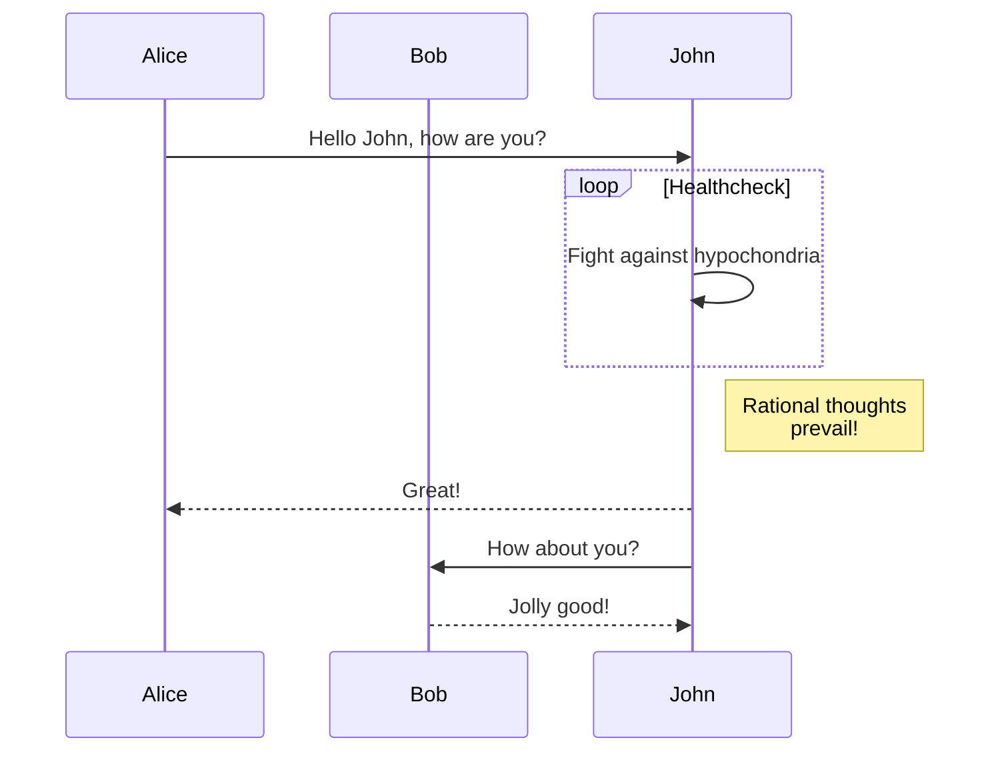

+++
title = "Composants"
description = "Comment utiliser les composants"
date = 2022-10-20
updated = 2026-08-16
[taxonomies]
tags = ["markdown", "css", "html"]
authors = ["salif"]
[extra]
mermaid = true
+++

Le thème Linkita fournit plusieurs composants.

Jamais entendu parler des composants ? Consultez la [documentation de Zola](https://keats.github.io/tera/#components) pour plus d'informations.

## Composant Mermaid

Pour utiliser Mermaid dans votre page, vous devez définir `extra.mermaid = true` dans le frontmatter de la page.

```toml
+++
title = "Le titre de votre page"

[extra]
mermaid = true
+++
```

Ensuite, vous pouvez utiliser le composant `<mermaid>` comme ceci :

```markdown


graph TD;
A-->B;
A-->C;
B-->D;
C-->D;


```

Ceci sera rendu comme :



graph TD;
A-->B;
A-->C;
B-->D;
C-->D;



De plus, vous pouvez utiliser un bloc de code à l'intérieur des composants `<mermaid>` et le bloc de code sera ignoré.

Le bloc de code empêche le formateur de casser la mise en forme de Mermaid.

````markdown





````

Ceci sera rendu comme :






## Admonition

Le composant `<admonition>` affiche une bannière pour vous aider à mettre en évidence une notice sur votre page.

Vous pouvez utiliser le composant comme ceci :

```markdown

L'admonition `tip`.

```

Le composant admonition a 12 types différents :


L'admonition `note`.



L'admonition `abstract`.



L'admonition `info`.



L'admonition `tip`.



L'admonition `success`.



L'admonition `question`.



L'admonition `warning`.



L'admonition `failure`.



L'admonition `danger`.



L'admonition `bug`.



L'admonition `example`.



L'admonition `quote`.


## Galerie

Le composant `<gallery />` est une galerie d'images cliquables très simple, en HTML uniquement, qui affiche toutes les images des ressources de la page.

Il provient de la [documentation de Zola](https://www.getzola.org/documentation/content/image-processing/)

```markdown
{{ <gallery /> }}
```

{{ <gallery page config alt="Image de démo pour la galerie" /> }}

## Projets

Le composant `<projects />` vous permet de créer une page pour vos projets.

Créez un fichier `content/pages/projects/index.md` :

```markdown
+++
title = "Mes Projets"
description = ""
path = "projets"
+++

{{ <projects path="data.toml" format="toml" page config /> }}
```

Créez un fichier `content/pages/projects/data.toml` :

```toml
[[project]]
name = "lorem"
desc = "Lorem ipsum dolor sit."
tags = ["lorem", "ipsum"]
links = [
    { name = "homepage", url = "https://example.com" },
    { name = "source", url = "https://example.com" },
]
```

Ceci sera affiché comme :

{{ <projects path="projects.toml" format="toml" page config /> }}
