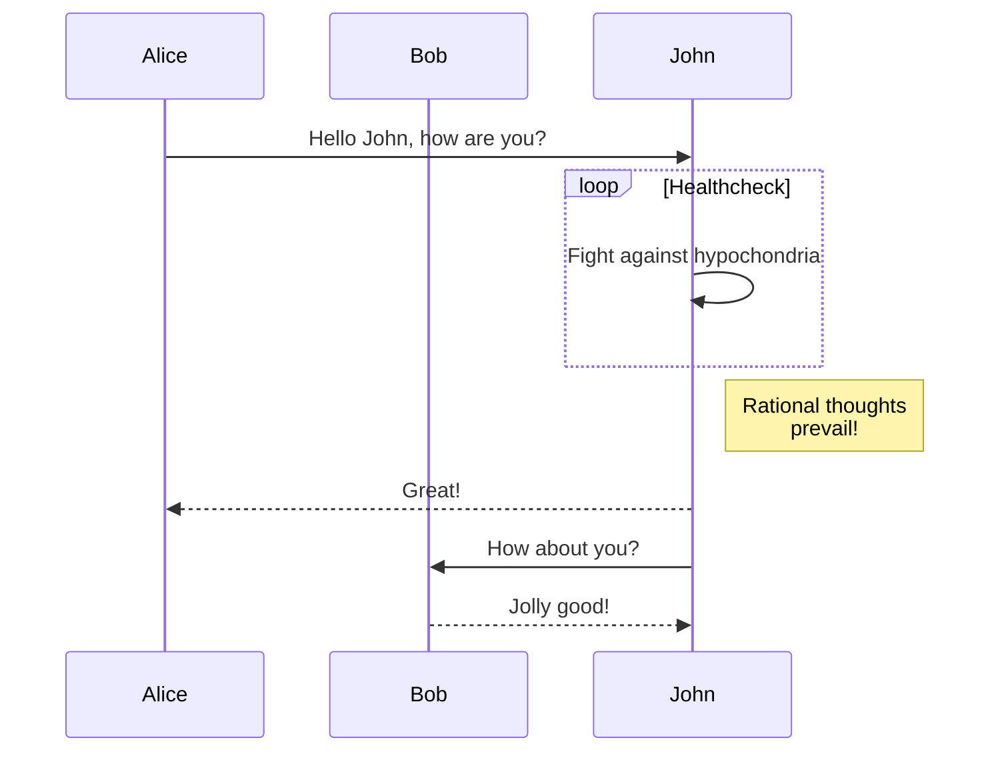

+++
title = "コンポーネント"
description = "コンポーネントの使い方"
date = 2022-10-20
updated = 2026-08-16
[taxonomies]
tags = ["markdown", "css", "html"]
authors = ["salif"]
[extra]
mermaid = true
+++

Linkitaテーマは複数のコンポーネントを提供します。

コンポーネントについてご存知ありませんか？ 詳細は [Zolaのドキュメント](https://keats.github.io/tera/#components) をご覧ください。

## Mermaid コンポーネント

ページでMermaidを使用するには、ページのフロントマターで `extra.mermaid = true` を設定する必要があります。

```toml
+++
title = "ページのタイトル"

[extra]
mermaid = true
+++
```

そうすれば、`<mermaid>` コンポーネントを次のように使用できます：

```markdown


graph TD;
A-->B;
A-->C;
B-->D;
C-->D;


```

これは次のようにレンダリングされます：



graph TD;
A-->B;
A-->C;
B-->D;
C-->D;



さらに、`<mermaid>` コンポーネント内にコードブロックを使用することができ、そのコードブロックは無視されます。

コードブロックを使用することで、フォーマッタがMermaidのフォーマットを崩すのを防ぎます。

````markdown





````

これは次のようにレンダリングされます：






## 注意喚起

`<admonition>` コンポーネントは、ページ内に注意喚起のバナーを表示します。

コンポーネントは次のように使用できます：

```markdown

これは `tip` のadmonitionです。

```

admonitionコンポーネントには12の異なるタイプがあります：


これは `note` のadmonitionです。



これは `abstract` のadmonitionです。



これは `info` のadmonitionです。



これは `tip` のadmonitionです。



これは `success` のadmonitionです。



これは `question` のadmonitionです。



これは `warning` のadmonitionです。



これは `failure` のadmonitionです。



これは `danger` のadmonitionです。



これは `bug` のadmonitionです。



これは `example` のadmonitionです。



これは `quote` のadmonitionです。


## ギャラリー

`<gallery />` コンポーネントは、ページのassetsからすべての画像を表示する、クリック可能な非常にシンプルなHTMLのみの画像ギャラリーです。

これは[Zolaのドキュメント](https://www.getzola.org/documentation/content/image-processing/)からの引用です。

```markdown
{{ <gallery /> }}
```

{{ <gallery page config alt="ギャラリーのデモ画像" /> }}

## プロジェクト

`<projects />` コンポーネントを使用すると、あなたのプロジェクトを紹介するページを作成できます。

`content/pages/projects/index.md` ファイルを作成します：

```markdown
+++
title = "私のプロジェクト"
description = ""
path = "projects"
+++

{{ <projects path="data.toml" format="toml" page config /> }}
```

`content/pages/projects/data.toml` ファイルを作成します：

```toml
[[project]]
name = "lorem"
desc = "Lorem ipsum dolor sit."
tags = ["lorem", "ipsum"]
links = [
    { name = "homepage", url = "https://example.com" },
    { name = "source", url = "https://example.com" },
]
```

これは次のように表示されます：

{{ <projects path="projects.toml" format="toml" page config /> }}
