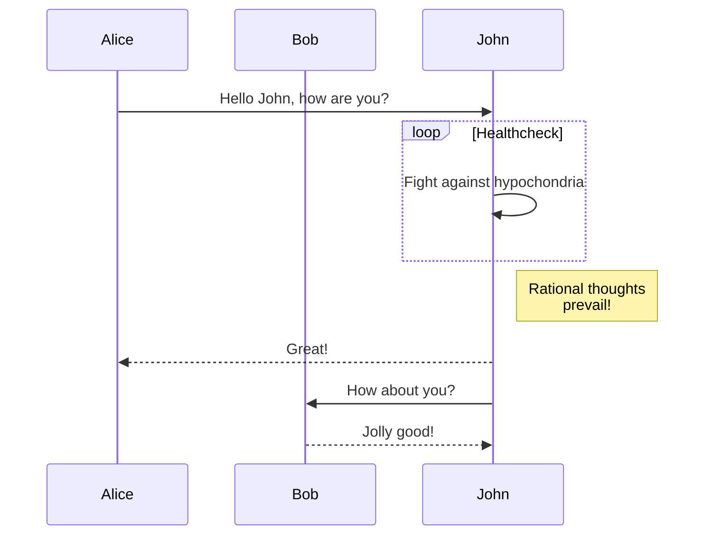

+++
title = "컴포넌트"
description = "컴포넌트 사용 방법"
date = 2022-10-20
updated = 2026-08-16
[taxonomies]
tags = ["markdown", "css", "html"]
authors = ["salif"]
[extra]
mermaid = true
+++

Linkita 테마는 여러 컴포넌트를 제공합니다.

컴포넌트에 대해 처음 들어보셨나요? 더 많은 정보는 [Zola 문서](https://keats.github.io/tera/#components)를 참조하세요.

## Mermaid 컴포넌트

페이지에서 Mermaid를 사용하려면, 페이지의 프론트매터에서 `extra.mermaid = true`로 설정해야 합니다.

```toml
+++
title = "페이지 제목"

[extra]
mermaid = true
+++
```

그런 다음 `<mermaid>` 컴포넌트를 다음과 같이 사용할 수 있습니다:

```markdown


graph TD;
A-->B;
A-->C;
B-->D;
C-->D;


```

이것은 다음과 같이 렌더링됩니다:



graph TD;
A-->B;
A-->C;
B-->D;
C-->D;



또한, `<mermaid>` 컴포넌트 안에 코드 블록을 사용할 수 있으며, 이 코드 블록은 무시됩니다.

코드 블록을 사용하면 포맷터가 Mermaid의 서식을 깨뜨리는 것을 방지할 수 있습니다.

````markdown





````

이것은 다음과 같이 렌더링됩니다:






## 경고 상자

`<admonition>` 컴포넌트는 페이지에 공지를 띄울 수 있도록 배너를 표시합니다.

`<admonition>` 컴포넌트는 다음과 같이 사용할 수 있습니다:

```markdown

`tip` 타입의 경고 상자입니다.

```

경고 상자 컴포넌트에는 12가지 다른 타입이 있습니다:


`note` 타입의 경고 상자입니다.



`abstract` 타입의 경고 상자입니다.



`info` 타입의 경고 상자입니다.



`tip` 타입의 경고 상자입니다.



`success` 타입의 경고 상자입니다.



`question` 타입의 경고 상자입니다.



`warning` 타입의 경고 상자입니다.



`failure` 타입의 경고 상자입니다.



`danger` 타입의 경고 상자입니다.



`bug` 타입의 경고 상자입니다.



`example` 타입의 경고 상자입니다.



`quote` 타입의 경고 상자입니다.


## 갤러리

`<gallery />` 컴포넌트는 페이지 에셋의 모든 이미지를 표시하는 매우 간단한 HTML 전용 클릭형 사진 갤러리입니다.

이 컴포넌트는 [Zola 문서](https://www.getzola.org/documentation/content/image-processing/)에서 가져왔습니다.

```markdown
{{ <gallery /> }}
```

{{ <gallery page config alt="갤러리 데모 이미지" /> }}

## 프로젝트

`<projects />` 컴포넌트를 사용하면 프로젝트 페이지를 만들 수 있습니다.

`content/pages/projects/index.md` 파일을 만드세요:

```markdown
+++
title = "내 프로젝트"
description = ""
path = "projects"
+++

{{ <projects path="data.toml" format="toml" page config /> }}
```

`content/pages/projects/data.toml` 파일을 만드세요:

```toml
[[project]]
name = "lorem"
desc = "Lorem ipsum dolor sit."
tags = ["lorem", "ipsum"]
links = [
    { name = "homepage", url = "https://example.com" },
    { name = "source", url = "https://example.com" },
]
```

이것은 다음과 같이 표시됩니다:

{{ <projects path="projects.toml" format="toml" page config /> }}
