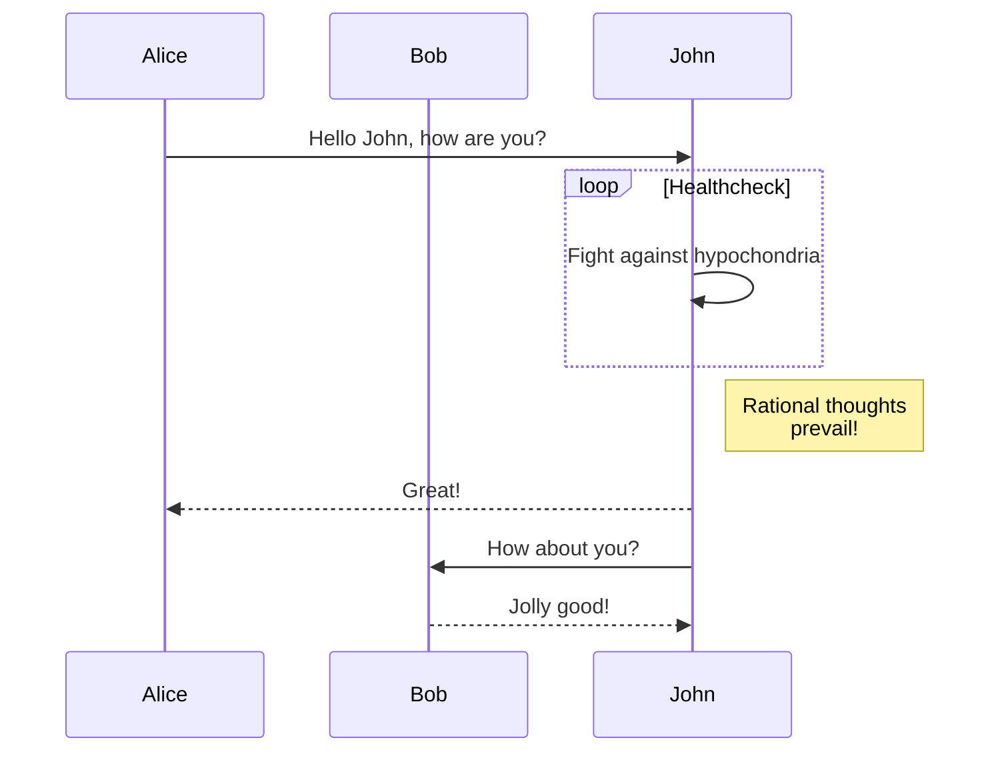

+++
title = "Components"
description = "How to use the components"
date = 2022-10-20
updated = 2026-08-16
[taxonomies]
tags = ["markdown", "css", "html"]
authors = ["salif"]
[extra]
mermaid = true
+++

The Linkita theme providers multiple components.

Never heard of components? See [Zola documentation](https://keats.github.io/tera/#components) for more information.

## Mermaid component

To use Mermaid in your page, you have to set `extra.mermaid = true` in the frontmatter of page.

```toml
+++
title = "Your page title"

[extra]
mermaid = true
+++
```

Then you can use the `<mermaid>` component like:

```markdown


graph TD;
A-->B;
A-->C;
B-->D;
C-->D;


```

This will be rendered as:



graph TD;
A-->B;
A-->C;
B-->D;
C-->D;



In addition, you can use code block inside `<mermaid>` components and the code block will be ignored.

The code block prevents formatter from breaking mermaid's formatting.

````markdown





````

This will be rendered as:






## Admonition

The `<admonition>` component displays a banner to help you put notice in your page.

You can use the component like:

```markdown

The `tip` admonition.

```

The admonition component has 12 different types:


The `note` admonition.



The `abstract` admonition.



The `info` admonition.



The `tip` admonition.



The `success` admonition.



The `question` admonition.



The `warning` admonition.



The `failure` admonition.



The `danger` admonition.



The `bug` admonition.



The `example` admonition.



The `quote` admonition.


## Gallery

The `<gallery />` component is very simple html-only clickable picture gallery that displays all images from the page assets.

It's from [Zola documentation](https://www.getzola.org/documentation/content/image-processing/)

```markdown
{{ <gallery /> }}
```

{{ <gallery page config alt="Demo image for the gallery" /> }}

## Projects

The `<projects />` component allows you to make a page for your projects.

Create a `content/pages/projects/index.md` file:

```markdown
+++
title = "My Projects"
description = ""
path = "projects"
+++

{{ <projects path="data.toml" format="toml" page config /> }}
```

Create a `content/pages/projects/data.toml` file:

```toml
[[project]]
name = "lorem"
desc = "Lorem ipsum dolor sit."
tags = ["lorem", "ipsum"]
links = [
    { name = "homepage", url = "https://example.com" },
    { name = "source", url = "https://example.com" },
]
```

This will be displayed as:

{{ <projects path="projects.toml" format="toml" page config /> }}
