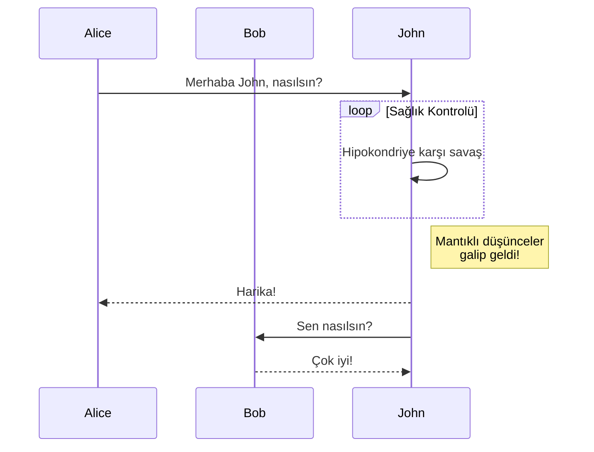

+++
title = "Bileşenler"
description = "Bileşenler nasıl kullanılır"
date = 2022-10-20
updated = 2026-08-16
[taxonomies]
tags = ["markdown", "css", "html"]
authors = ["salif"]
[extra]
mermaid = true
+++

Linkita teması çeşitli bileşenler sunar.

Bileşenleri hiç duymadınız mı? Daha fazla bilgi için [Zola dokümantasyonuna](https://keats.github.io/tera/#components) bakın.

## Mermaid bileşeni

Sayfanızda Mermaid kullanmak için, sayfanın ön yüzünde `extra.mermaid = true` olarak ayarlamanız gerekir.

```toml
+++
title = "Sayfa başlığınız"

[extra]
mermaid = true
+++
```

Ardından `<mermaid>` bileşenini şu şekilde kullanabilirsiniz:

```markdown


graph TD;
A-->B;
A-->C;
B-->D;
C-->D;


```

Bu şu şekilde görüntülenecektir:



graph TD;
A-->B;
A-->C;
B-->D;
C-->D;



Ek olarak, `<mermaid>` bileşenlerinin içinde kod bloğu kullanabilirsiniz ve kod bloğu göz ardı edilecektir.

Kod bloğu, biçimlendiricinin mermaid'in biçimlendirmesini bozmasını engeller.

````markdown





````

Bu şu şekilde görüntülenecektir:






## Uyarı Kutuları

`<admonition>` bileşeni, sayfanıza dikkat çekici notlar yerleştirmenize yardımcı olacak bir başlık görüntüler.

Bileşeni şu şekilde kullanabilirsiniz:

```markdown

`ipucu` uyarı kutusu.

```

Uyarı kutusu bileşeninin 12 farklı türü vardır:


`not` uyarı kutusu.



`özet` uyarı kutusu.



`bilgi` uyarı kutusu.



`ipucu` uyarı kutusu.



`başarılı` uyarı kutusu.



`soru` uyarı kutusu.



`warning` uyarı kutusu.



`failure` uyarı kutusu.



`danger` uyarı kutusu.



`bug` uyarı kutusu.



`example` uyarı kutusu.



`quote` uyarı kutusu.


## Galeri

`<gallery />` bileşeni, sayfa varlıklarındaki tüm resimleri görüntüleyen çok basit, yalnızca HTML tabanlı tıklanabilir bir resim galerisidir.

[Zola dokümantasyonundan](https://www.getzola.org/documentation/content/image-processing/) alınmıştır.

```markdown
{{ <gallery /> }}
```

{{ <gallery page config alt="Galeri için demo resim" /> }}

## Projeler

`<projects />` bileşeni, projeleriniz için bir sayfa oluşturmanıza olanak tanır.

Bir `content/pages/projects/index.md` dosyası oluşturun:

```markdown
+++
title = "Projelerim"
description = ""
path = "projects"
+++

{{ <projects path="data.toml" format="toml" page config /> }}
```

Bir `content/pages/projects/data.toml` dosyası oluşturun:

```toml
[[project]]
name = "lorem"
desc = "Lorem ipsum dolor sit."
tags = ["lorem", "ipsum"]
links = [
    { name = "homepage", url = "https://example.com" },
    { name = "source", url = "https://example.com" },
]
```

Bu şu şekilde görüntülenecektir:

{{ <projects path="projects.toml" format="toml" page config /> }}
