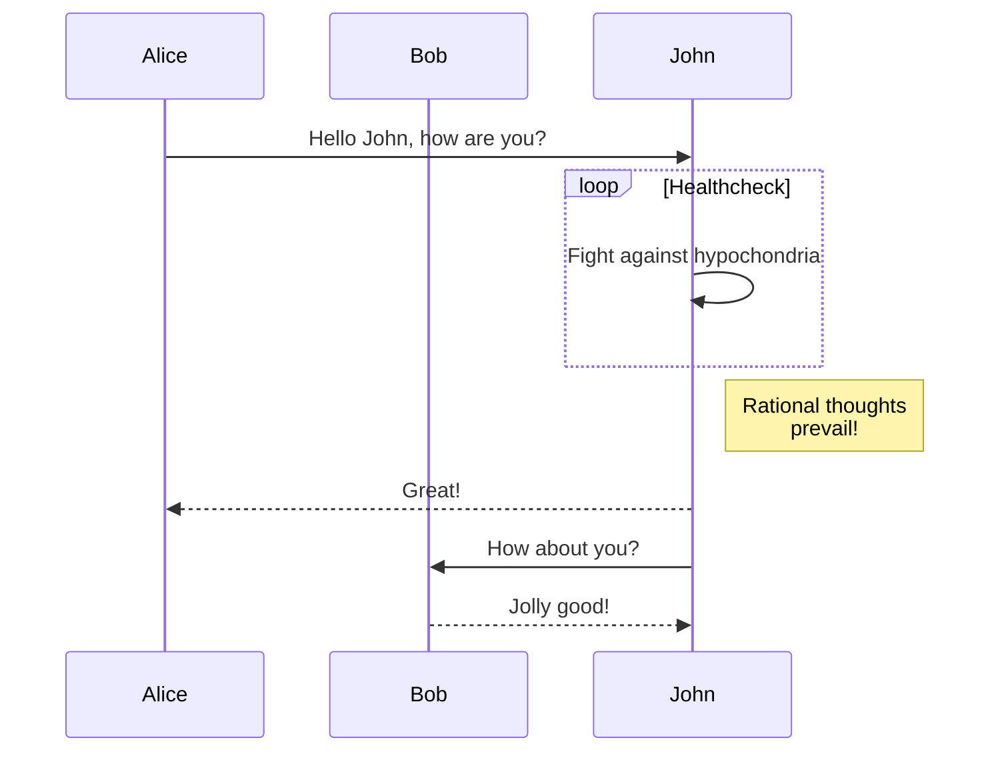

+++
title = "组件"
description = "如何使用组件"
date = 2022-10-20
updated = 2026-08-16
[taxonomies]
tags = ["markdown", "css", "html"]
authors = ["salif"]
[extra]
mermaid = true
+++

林基塔主题提供了多种组件。

没听说过组件？请参阅 [Zola 文档](https://keats.github.io/tera/#components) 获取更多信息。

## Mermaid 组件

要在页面中使用 Mermaid，您需要在页面的 frontmatter 中设置 `extra.mermaid = true`。

```toml
+++
title = "您的页面标题"

[extra]
mermaid = true
+++
```

然后您可以使用 `<mermaid>` 组件，例如：

```markdown


graph TD;
A-->B;
A-->C;
B-->D;
C-->D;


```

这将被渲染为：



graph TD;
A-->B;
A-->C;
B-->D;
C-->D;



此外，您可以在 `<mermaid>` 组件内使用代码块，代码块将被忽略。

代码块可以防止格式化程序破坏 mermaid 的格式。

````markdown





````

这将被渲染为：






## 提示框

`<admonition>` 组件显示一个横幅，帮助您在页面中放置提示。

您可以像这样使用组件：

```markdown

`tip` 提示框。

```

提示框组件有 12 种不同的类型：


`note` 提示框。



`abstract` 提示框。



`info` 提示框。



`tip` 提示框。



`success` 提示框。



`question` 提示框。



`warning` 提示框。



`failure` 提示框。



`danger` 提示框。



`bug` 提示框。



`example` 提示框。



`quote` 提示框。


## 画廊

`<gallery />` 组件是一个非常简单的纯 HTML 可点击图片画廊，用于显示页面资源中的所有图像。

它来自 [Zola 文档](https://www.getzola.org/documentation/content/image-processing/)

```markdown
{{ <gallery /> }}
```

{{ <gallery page config alt="画廊的演示图片" /> }}

## 项目

`<projects />` 组件允许您为您的项目创建一个页面。

创建一个 `content/pages/projects/index.md` 文件：

```markdown
+++
title = "我的项目"
description = ""
path = "projects"
+++

{{ <projects path="data.toml" format="toml" page config /> }}
```

创建一个 `content/pages/projects/data.toml` 文件：

```toml
[[project]]
name = "lorem"
desc = "Lorem ipsum dolor sit."
tags = ["lorem", "ipsum"]
links = [
    { name = "homepage", url = "https://example.com" },
    { name = "source", url = "https://example.com" },
]
```

这将显示为：

{{ <projects path="projects.toml" format="toml" page config /> }}
