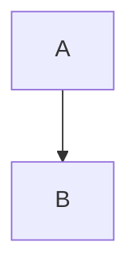

+++
title = "مهاجرت به Zola 0.23.4"
description = "چگونگی ارتقا و مهاجرت سایت لینکیتا به Zola v0.23.4"
date = 2026-09-12
path = "fa/update-2"
[taxonomies]
tags = ["meta"]
authors = ["salif"]
[extra]
inline_code_fix = true
+++

نسخه Zola v0.23 موتور قالب‌ساز خود، Tera، را با یک نسخه اصلی جدید (Tera v2) جایگزین کرد. خود پروژه زولا آن را این‌گونه نامیده است:
> احتمالاً بیشترین تغییرات شکننده (breaking changes) در تاریخ زولا

و قالب‌های لینکیتا نیز برای سازگاری با آن بازنویسی شدند. این صفحه شما را در فرآیند انتقال یک سایت لینکیتا از Zola v0.22.1 به Zola v0.23.4 راهنمایی می‌کند.

## انتقال مخزن گیت

پوسته لینکیتا هم‌زمان از Codeberg به GitHub منتقل شد. اگر همچنان از مخزن Codeberg استفاده می‌کنید، ابتدا باید به مخزن GitHub سوییچ کنید. برای کاربران زیرماژول (submodule)، دستورالعمل‌ها به شرح زیر است:

```sh
git submodule init
git config -f .gitmodules submodule."themes/linkita".url https://github.com/salif/linkita.git
git config -f .gitmodules submodule."themes/linkita".branch tera1
git submodule sync
git submodule update
git add .gitmodules
```

## چه کسانی به این راهنما نیاز دارند؟

این راهنما برای شماست اگر سایت شما هم‌اکنون از لینکیتا روی شاخه `tera1` (یا روی `linkita` / `v4`) با نسخه Zola v0.22.1 یا قدیمی‌تر استفاده می‌کند.

اگر هنوز مایل به ارتقای زولا نیستید، نیازی به انجام کاری ندارید – شاخه `tera1` به کار با نسخه‌های قدیمی زولا ادامه خواهد داد و حذف نخواهد شد.

## مرحله ۱: ارتقای زولا به v0.23.4

نسخه Zola v0.23.4 یا جدیدتر را نصب کنید. نسخه نصب‌شده خود را بررسی کنید:

```sh
zola --version
```

نسخه Zola v0.23 یک جهش بزرگ است. اگر سایت شما قالب‌های سفارشی فراتر از قالب‌های پیش‌فرض لینکیتا دارد، نگاهی به [تغییرات Zola v0.23.0](https://github.com/getzola/zola/blob/master/CHANGELOG.md#0230-2026-08-05) بیندازید – بقیه این راهنما صرفاً مواردی را پوشش می‌دهد که در سمت لینکیتا تغییر کرده است.

## مرحله ۲: تغییر به شاخه `main`

شاخه `main` لینکیتا اکنون نسخه‌های Zola v0.23.0 به بعد را هدف قرار می‌دهد. شاخه `tera1` روی موتور قالب قبلی برای Zola v0.22.1 و قدیمی‌تر باقی می‌ماند.

اگر لینکیتا را به عنوان زیرماژول گیت نصب کرده‌اید:

```sh
git submodule set-branch --branch main themes/linkita
git submodule update --remote themes/linkita
```

## مرحله ۳: به‌روزرسانی `zola.toml` / `config.toml`

موارد زیر را تک به تک بررسی کنید. هیچ‌کدام از این‌ها توسط زولا اجبار نمی‌شوند – باقی ماندن کلیدهای قدیمی مانع ساخت سایت شما نمی‌شود، اما آن‌ها بی‌صدا از کار خواهند افتاد؛ بنابراین ارزش پاک‌سازی و به‌روزرسانی دارند.

### پیوندهای منو و شبکه‌های اجتماعی: `$BASE_URL` ← `@base`

مقدار `$BASE_URL` در `extra.menus`، آدرس‌های وب `social` در پروفایل، و همچنین `extra.footer.license_url` اکنون با `@base` نوشته می‌شوند:

```toml ,name=zola.toml
# قبل
[extra.menus]
menu_name = [
  { url = "$BASE_URL/blog/", name = "بایگانی" },
]

# بعد
[extra.menus]
menu_name = [
  { url = "@base/blog/", name = "بایگانی" },
]
```

همین تغییر نام برای ورودی‌های `social` در نمایه کاربری و `extra.footer.license_url` نیز اعمال می‌شود. اگر ترجیح می‌دهید، می‌توانید به جای `@base` از [پیوندهای داخلی زولا](https://www.getzola.org/documentation/content/linking/#internal-links) (`@/...`) نیز استفاده کنید.

همچنین یک پیشوند جدید به نام `@lang` برای نشانی‌های اینترنتی منو و شبکه‌های اجتماعی وجود دارد که در صورت نیاز، مسیری را در یک زبان مشخص پیدا می‌کند.

توجه داشته باشید که این موضوع در مورد `extra.footer.copyright` **صدق نمی‌کند** – آن رشته مانند گذشته همچنان از `$BASE_URL` و `$YEAR` و `$LICENSE_URL` استفاده می‌کند:

```toml ,name=zola.toml
[extra.footer]
copyright = "&copy;&nbsp;$YEAR نام شما &vert; [CC BY-SA 4.0]($LICENSE_URL)"
```

### نمایه‌ها: ساده‌سازی تنظیمات Open Graph

جدول فرعی `[extra.profiles.<user>.open_graph]` حذف شده است. فیلدهای `image` و `image_alt` یک سطح به بالا منتقل شده و تغییر نام داده‌اند؛ فیلد `fediverse_creator` نیز یک سطح به بالا منتقل شد و فیلدهای اختصاصی فیس‌بوک (`first_name` و `last_name` و `username` و `gender` و `fb_app_id` و `fb_admins`) به همراه بخش ترجمه Open Graph برای هر زبان به طور کامل حذف شدند:

```toml ,name=zola.toml
# قبل
[extra.profiles.your_username.open_graph]
image = "cover.png"
image_alt = "توضیح تصویر"
fediverse_creator = { handle = "me", domain = "mastodon.social" }

# بعد
[extra.profiles.your_username]
# ...avatar_url و name و bio و social و غیره مانند قبل، به علاوه:
og_image = "cover.png"
og_image_alt = "توضیح تصویر"
fediverse_creator = { handle = "me", domain = "mastodon.social" }
```

اگر به فیلدهای `first_name` / `last_name` / `gender` / `fb_app_id` / `fb_admins` یا به تنظیم اختصاصی زبان `open_graph.languages.<lang>.image_alt` متکی بودید، جایگزین مستقیمی وجود ندارد – این فیلدهای Open Graph دیگر توسط پوسته تولید نمی‌شوند.

### گزینه‌های زبان: حذف `locale` و تغییر نحوه فرمت تاریخ

فیلتر `date` در زولا دیگر ورودی `locale` دریافت نمی‌کند؛ بنابراین متغیر `extra.languages.<lang>.locale` (به عنوان مثال `locale = "fr_FR"`) حذف شده است. فرمت‌بندی تاریخ از کریت `chrono` به `jiff` منتقل شده است، بنابراین رشته‌های `date_format` اکنون بر اساس [مرجع strftime در jiff](https://docs.rs/jiff/latest/jiff/fmt/strtime/index.html#conversion-specifications) تفسیر می‌شوند و نه chrono.

```toml ,name=zola.toml
# قبل
[extra.languages.fr]
locale = "fr_FR"
date_format = "%x"

# بعد
[extra.languages.fr]
date_format = "%F"
num_format = "fr"
```

اثر عملی: اگر به `locale` وابسته بودید تا نام ترجمه‌شده ماه‌ها/روزهای هفته (از طریق توکن‌هایی مثل `%B` یا `%A`) را چاپ کند، این کار دیگر به صورت خودکار انجام نمی‌شود. توکن‌های `date_format` خود را با مستندات jiff بررسی کنید – ممکن است بخواهید از فرمت کاملاً عددی استفاده کنید یا بپذیرید که نام ماه‌ها و روزها با خروجی پیش‌فرض jiff برای آن توکن نمایش داده شود. متغیر `num_format` (برای فرمت‌بندی اعداد، که ارتباطی به تاریخ ندارد) بدون تغییر مانده و همچنان برای هر زبان تنظیم می‌شود.

### حذف `disable_javascript`

متغیر پیکربندی `extra.disable_javascript` که به شما اجازه می‌داد جاوااسکریپت پوسته را غیرفعال کرده و با تزریق کد (injects) مجدداً خودتان آن را پیاده‌سازی کنید، حذف شده است.

### پیوندهای مستندات

اگر به مستندات خود لینکیتا پیوند داده‌اید، توجه داشته باشید که صفحه نمایش شورت‌کدها از `/shortcodes/` به `/components/` منتقل شده است (برای مثال، ویژگی پروژه‌ها اکنون در نشانی `https://salif.github.io/linkita/components/#projects` مستند شده است).

توضیحات مربوط به تصویر جلد (cover image) شفاف‌سازی شده است تا مشخص شود `extra.cover.image` یا نام یک فایل از دارایی‌های صفحه و یا یک مسیر سازگار با `get_url` را می‌پذیرد – این قابلیت قبلاً هم کار می‌کرد، فقط به طور صریح ذکر نشده بود.

## مرحله ۴: به‌روزرسانی محتوا – شورت‌کدها اکنون مولفه (Components) هستند

این تغییری است که احتمالاً بیشترین تأثیر را روی نوشته‌های موجود شما می‌گذارد.

نسخه Zola v0.23 ویژگی کدهای کوتاه (shortcodes) را به طور کامل حذف کرد. دیگر پوشه‌ای به نام `templates/shortcodes/` وجود ندارد، و شیوه قبلی فراخوانی شورت‌کد به صورت تابع در متن مارک‌داون (با یا بدون محتوا) منسوخ شده است – هر دو فرم اکنون با خطای "unknown function" یا "unknown tag" بیلد را متوقف می‌کنند. در عوض، فایل‌های `.md` شما مستقیماً توسط موتور Tera مانند قالب‌های `.html` قالب‌بندی می‌شوند، و شما **مولفه‌های** داخلی لینکیتا را با ساختار فراخوانی جدید Tera v2 فراخوانی می‌کنید.

مولفه‌ای که محتوا دارد به صورت زیر فراخوانی می‌شود – توجه کنید که علامت‌های درصد و آکولاد تگ‌های علامت کوچکتر/بزرگتر را احاطه می‌کنند، نه آکولاد دوتایی:

```markdown

محتوای متن

```

مولفه‌ای که بدون محتوا است (خودبسته شونده) به جای آن از آکولادهای دوتایی استفاده می‌کند:

```markdown

```

### اعلان (Admonition)

```markdown
# قبل

این متن یک **نکته** است.


# بعد

این متن یک **نکته** است.

```

### نگارخانه (Gallery)

نگارخانه اکنون نیاز دارد `page` و `config` به طور صریح به آن فرستاده شوند (مولفه‌های Tera v2 دسترسی ضمنی به page/config مانند شورت‌کدهای قدیمی ندارند – شما آن‌ها را با نام پاس می‌دهید و از آنجا که نام متغیرها با نام پارامترها مطابقت دارد، می‌توانید بنویسید `page config`):

```markdown
# قبل
{{ gallery() }}

# بعد

```

### Mermaid

````markdown
# قبل




# بعد



````

خط‌های تیره تنظیم فواصل سفید را همان‌طور که در بالا نشان داده شده (دقیقاً پس از علامت باز کردن درصد و قبل از علامت بستن درصد) استفاده کنید – بدون آن‌ها، خط خالی ابتدایی قبل از بلوک کد حذف نمی‌شود و نمودار به همراه علامت‌های ` ```mermaid ` نمایش داده می‌شود به جای اینکه توسط مولفه پاک‌سازی شود.

### پروژه‌ها (Projects)

مولفه پروژه‌ها نیز اکنون نیاز دارد `page` و `config` به صورت صریح فرستاده شوند:

```markdown
# قبل
{{ projects(path="data.toml", format="toml") }}

# بعد

```

### اگر در نوشته‌های خود درباره ساختار Tera می‌نویسید

از آنجا که فایل‌های `.md` اکنون قبل از تجزیه مارک‌داون توسط موتور Tera پردازش می‌شوند، تگ‌های Tera درون یک بلوک کد – مانند مثال‌های بالا – حتی درون علامت‌های سه‌گانه بک‌تیک نیز اجرا خواهند شد و نمایش داده نمی‌شوند. برای نمایش دقیق متن آن‌ها، هر نمونه‌ای از این دست را درون یک بلوک `raw` قرار دهید:

```markdown

...

```

## مرحله ۵: فایل‌های زبان سفارشی

اگر فایل سفارشی `static/i18n/<lang>.json` اضافه کرده‌اید، تغییرات خود را با فایل زبان پیش‌فرض پوسته همگام‌سازی کنید.

## مرحله ۶ (پیشرفته): بازنویسی یا تزریق قالب‌های سفارشی

این بخش را نادیده بگیرید مگر اینکه یکی از قالب‌های لینکیتا را خودتان بازنویسی کرده باشید، یا ماکروهای داخلی آن را مستقیماً از قالب‌های خودتان فراخوانی کنید.

ماکروهای Tera v1 در Tera v2 حذف شده و با **مولفه‌ها (components)** جایگزین شده‌اند که به صورت عمومی و با نام فراخوانی می‌شوند – دیگر نیازی به `` یا پیشوند `self::` نیست.

سایر تغییرات ساختاری Tera v2 در میان قالب‌ها به صورت زیر است:

- متدهای `trim_start_matches(pat=...)` و `trim_end_matches(pat=...)` اکنون به `trim_start(pat=...)` و `trim_end(pat=...)` تبدیل شده‌اند.
- متد `linebreaksbr` به `newlines_to_br` تغییر یافته است.
- متد `default(value=x)` اکنون نیازمند `boolean=true` است (یعنی `default(value=x, boolean=true)`) تا رشته‌های خالی یا `false` را به عنوان «استفاده از مقدار پیش‌فرض» در نظر بگیرد؛ در غیر این صورت تنها مقادیر نامشخص (undefined/null) باعث فراخوانی پیش‌فرض می‌شوند.
- زنجیره‌سازی اختیاری (`?.` / `?[...]`) در دسترس است و برای خواندن مقادیر تنظیمی که ممکن است وجود نداشته باشند به کار می‌رود.
- زمینه سراسری (`page`، `config`، `lang` و غیره) دیگر مانند گذشته به صورت ضمنی درون مولفه در دسترس نیست – مولفه‌ها باید آن را صراحتاً اعلام و دریافت کنند، به همین دلیل پارامترهای `page: map` و `config: map` را در تمام قالب‌های جدید مشاهده می‌کنید.
- قالب‌های سفارشی `templates/sitemap.xml` و `templates/split_sitemap_index.xml` از پوسته حذف شده‌اند. اگر قبلاً هر یک از این‌ها را بازنویسی کرده بودید، بررسی کنید که آیا هنوز به آن‌ها نیاز دارید یا خیر.

برای تصویر کامل تغییرات صورت گرفته در خود Tera، [راهنمای مهاجرت Tera v1 به v2](https://github.com/Keats/tera/blob/master/MIGRATION.md) را ببینید.

## مرحله ۷: بازسازی و بررسی سایت

```sh
zola build
```

سپس سایت را بررسی کنید، به خصوص:

- گزینه‌های منو و نمادهای شبکه‌های اجتماعی به نشانی‌های درست هدایت شوند (تغییر `@base`).
- تصویر و توضیحات Open Graph نمایه شما و تگ پیوند تأیید Fediverse در `<head>` صفحه حاضر باشند.
- فرمت‌بندی تاریخ در زبان‌های غیر انگلیسی همچنان مناسب باشد (عدم نمایش خودکار نام ماه‌ها/روزها به صورت محلی).
- اعلان‌ها، نگارخانه‌ها، نمودارهای Mermaid یا صفحه پروژه‌ها به درستی نمایش داده شوند.

## راهنمایی و پشتیبانی

اگر موردی با آنچه در اینجا توضیح داده شده مطابقت ندارد، به [README](https://github.com/salif/linkita/blob/main/README.md) و [CHANGELOG](https://github.com/salif/linkita/blob/main/CHANGELOG.md) در شاخه `main` مراجعه کرده یا در بخش [گفت‌وگوهای گیت‌هاب](https://github.com/salif/linkita/discussions) مطرح کنید.
