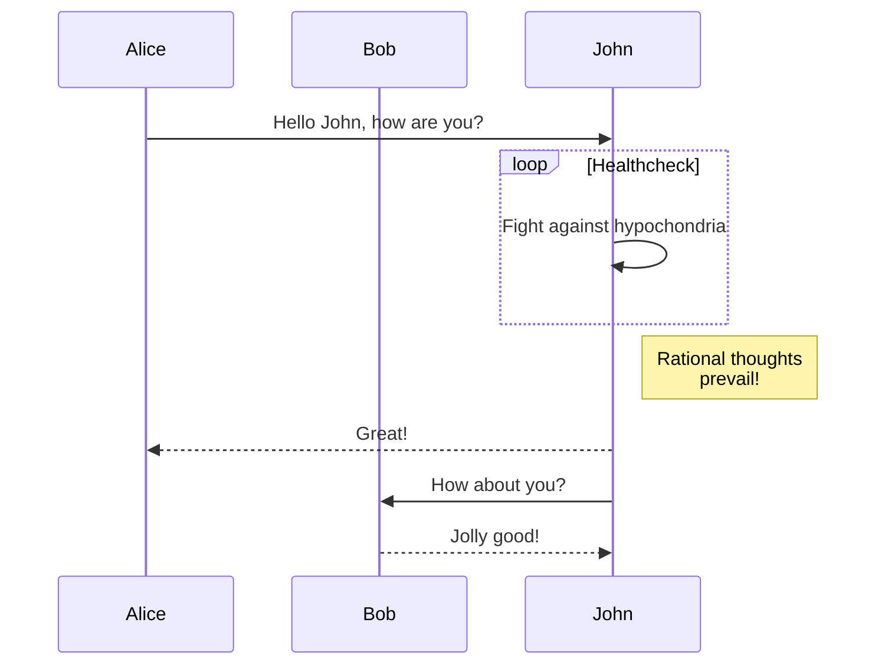

+++
title = "Shortcody"
description = "Shortcody šablony Linkita."
date = 2022-10-20
updated = 2025-04-20
[taxonomies]
tags = ["markdown", "css", "html"]
authors = ["kita", "salif"]
[extra]
mermaid = true
+++

Šablona Linkita poskytuje několik shortcodů.

Nikdy jste o shortcodech neslyšeli? Více informací naleznete v [dokumentaci Zoly](https://www.getzola.org/documentation/content/shortcodes/).

## Mermaid {#mermaid-header}

Chcete-li na své stránce použít Mermaid, musíte v její frontmatter části nastavit `extra.mermaid = true`.

```toml
+++
title = "Titulek vaší stránky"

[extra]
mermaid = true
+++
```

Poté můžete shortcode `mermaid()` použít takto:

```markdown


graph TD;
A-->B;
A-->C;
B-->D;
C-->D;


```

Toto bude vykresleno jako:



graph TD;
A-->B;
A-->C;
B-->D;
C-->D;



Kromě toho můžete uvnitř shortcodu `mermaid()` použít blok kódu, který bude ignorován.

Blok kódu zabraňuje formátovači, aby rozbil formátování diagramu Mermaid.

````markdown





````

Toto bude vykresleno jako:






## Poznámky

Shortcode `admonition()` zobrazí banner, který vám pomůže umístit na stránku upozornění.

Shortcode `admonition()` můžete použít takto:

```markdown

`tip` poznámka.

```

Shortcode pro poznámky má 12 různých typů:


`note` poznámka.



`abstract` poznámka.



`info` poznámka.



`tip` poznámka.



`success` poznámka.



`question` poznámka.



`warning` poznámka.



`failure` poznámka.



`danger` poznámka.



`bug` poznámka.



`example` poznámka.



`quote` poznámka.


## Galerie

Shortcode `gallery()` je velmi jednoduchá, klikatelná obrázková galerie (pouze HTML), která zobrazuje všechny obrázky z prostředků stránky (page assets).

Pochází z [dokumentace Zoly](https://www.getzola.org/documentation/content/image-processing/)

```markdown
{{/* gallery(alt="Ukázkový obrázek pro galerii") */}}
```

{{ gallery(alt="Ukázkový obrázek pro galerii") }}

## Projekty

Shortcode `projects()` vám umožní vytvořit stránku pro vaše projekty.

Vytvořte soubor `content/pages/projects/index.md`:

```markdown
+++
title = "Moje projekty"
description = ""
path = "projects"
+++

{{/* projects(path="data.toml", format="toml") */}}
```

Vytvořte soubor `content/pages/projects/data.toml`:

```toml
[[project]]
name = "lorem"
desc = "Lorem ipsum dolor sit."
tags = ["lorem", "ipsum"]
links = [
    { name = "homepage", url = "https://example.com" },
    { name = "source", url = "https://example.com" },
]
```

Toto bude zobrazeno jako:

{{ projects(path="projects.toml", format="toml") }}
