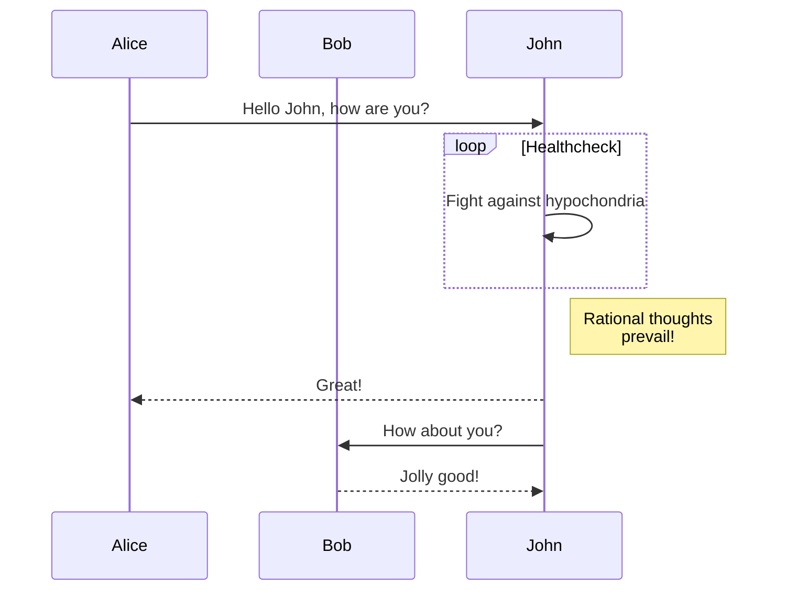

+++
title = "Mallongigoj"
date = 2022-10-20
updated = 2024-10-24
description = "La mallongigoj de la temo Linkita."
[taxonomies]
tags = ["markdown", "css", "html"]
[extra]
mermaid = true
+++

La temo Linkita provizas plurajn mallongigojn.

Ĉu vi neniam aŭdis pri mallongigoj? Vidu la [dokumentaron de Zola](https://www.getzola.org/documentation/content/shortcodes/) por pli da informoj.

## Mermaid

Por uzi Mermaid en via paĝo, vi devas agordi `extra.mermaid = true` en la antaŭaĵo (frontmatter) de la paĝo.

```markdown
+++
title = "La titolo de via paĝo"

[extra]
mermaid = true
+++
```

Tiam vi povas uzi la mallongigon `mermaid()` jene:

```markdown


graph TD;
A-->B;
A-->C;
B-->D;
C-->D;


```

Ĉi tio estos montrata tiel:



graph TD;
A-->B;
A-->C;
B-->D;
C-->D;



Krome, vi povas uzi kodblokon ene de la mallongigo `mermaid()` kaj la kodbloko estos ignorata.

La kodbloko malhelpas ke la formatilo rompu la formatadon de Mermaid.

````markdown





````

Ĉi tio estos montrata tiel:






## Admono

La mallongigo `admonition()` montras rubandon por helpi vin meti atentigon en vian paĝon.

Vi povas uzi la mallongigon `admonition()` jene:

```markdown

La admono `konsileto`.

```

La mallongigo `admonition` havas 12 diversajn tipojn:


La admono `noto`.



La admono `resumo`.



La admono `informo`.



La admono `konsileto`.



La admono `sukceso`.



La admono `demando`.



La admono `averto`.



La admono `malsukceso`.



La admono `danĝero`.



La admono `cimo`.



La admono `ekzemplo`.



La admono `citaĵo`.


## Galerio

La mallongigo `gallery()` estas tre simpla nur-HTML-a klakebla bildgalerio, kiu montras ĉiujn bildojn el la paĝaj aktivaĵoj (assets).

Ĝi estas el la [dokumentaro de Zola](https://www.getzola.org/documentation/content/image-processing/)

```markdown
{{/* gallery() */}}
```

{{ gallery() }}
