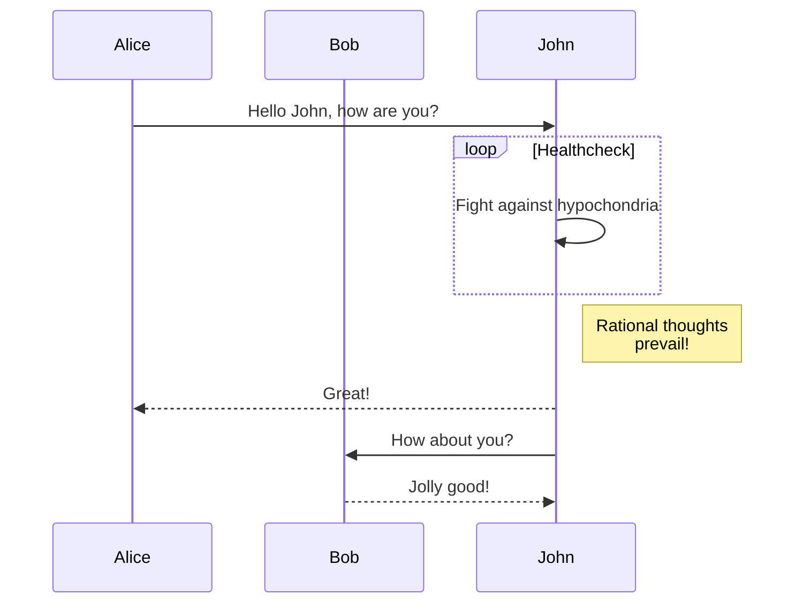

+++
title = "Shortcodes"
description = "Los shortcodes del tema Linkita."
date = 2022-10-20
updated = 2025-04-20
[taxonomies]
tags = ["markdown", "css", "html"]
authors = ["kita", "salif"]
[extra]
mermaid = true
+++

El tema Linkita proporciona múltiples shortcodes.

¿Nunca has oído hablar de los shortcodes? Consulta la [documentación de Zola](https://www.getzola.org/documentation/content/shortcodes/) para más información.

## Mermaid {#mermaid-header}

Para usar Mermaid en tu página, tienes que establecer `extra.mermaid = true` en el frontmatter de la página.

```toml
+++
title = "El título de tu página"

[extra]
mermaid = true
+++
```

Luego puedes usar los shortcodes `mermaid()` así:

```markdown


graph TD;
A-->B;
A-->C;
B-->D;
C-->D;


```

Esto se renderizará como:



graph TD;
A-->B;
A-->C;
B-->D;
C-->D;



Además, puedes usar un bloque de código dentro de los shortcodes `mermaid()` y el bloque de código será ignorado.

El bloque de código evita que el formateador rompa el formato de Mermaid.

````markdown





````

Esto se renderizará como:






## Admonition

El shortcode `admonition()` muestra un banner para ayudarte a poner avisos en tu página.

Puedes usar el shortcode `admonition()` así:

```markdown

La admonition de tipo `tip`.

```

El shortcode de admonition tiene 12 tipos diferentes:


La admonition de tipo `note`.



La admonition de tipo `abstract`.



La admonition de tipo `info`.



La admonition de tipo `tip`.



La admonition de tipo `success`.



La admonition de tipo `question`.



La admonition de tipo `warning`.



La admonition de tipo `failure`.



La admonition de tipo `danger`.



La admonition de tipo `bug`.



La admonition de tipo `example`.



La admonition de tipo `quote`.


## Galería

El shortcode `gallery()` es una galería de imágenes clicable muy simple, solo con HTML, que muestra todas las imágenes de los assets de la página.

Proviene de la [documentación de Zola](https://www.getzola.org/documentation/content/image-processing/)

```markdown
{{/* gallery() */}}
```

{{ gallery(alt="Imagen de demostración para la galería") }}

## Proyectos

El shortcode `projects()` te permite crear una página para tu proyecto.

Crea un archivo `content/pages/projects/index.md`:

```markdown
+++
title = "Mis Proyectos"
description = ""
path = "projects"
+++

{{/* projects(path="data.toml", format="toml") */}}
```

Crea un archivo `content/pages/projects/data.toml`:

```toml
[[project]]
name = "lorem"
desc = "Lorem ipsum dolor sit."
tags = ["lorem", "ipsum"]
links = [
    { name = "homepage", url = "https://example.com" },
    { name = "source", url = "https://example.com" },
]
```

Esto se mostrará como:

{{ projects(path="projects.toml", format="toml") }}
