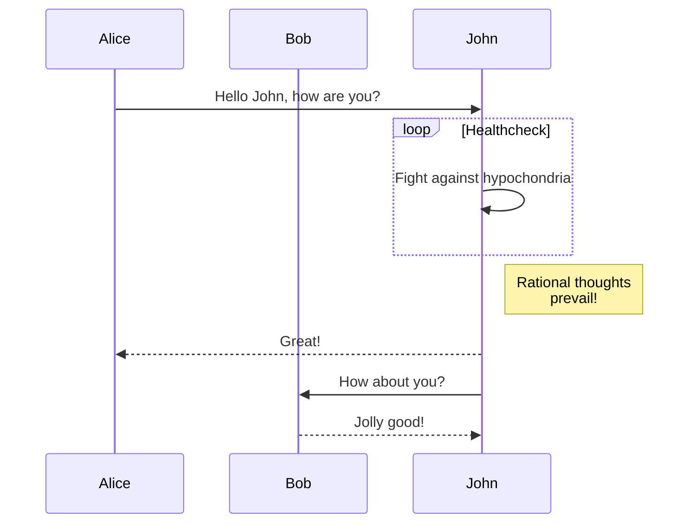

+++
title = "Pikakoodit"
description = "Linkita-teeman pikakoodit."
date = 2022-10-20
updated = 2025-04-20
[taxonomies]
tags = ["markdown", "css", "html"]
authors = ["kita", "salif"]
[extra]
mermaid = true
+++

Linkita-teema tarjoaa useita pikakoodeja.

Etkö ole koskaan kuullut pikakoodeista? Katso lisätietoja [Zolan dokumentaatiosta](https://www.getzola.org/documentation/content/shortcodes/).

## Mermaid {#mermaid-header}

Käyttääksesi Mermaidia sivullasi, sinun tulee asettaa `extra.mermaid = true` sivun frontmatter-osioon.

```toml
+++
title = "Sivusi otsikko"

[extra]
mermaid = true
+++
```

Sitten voit käyttää `mermaid()`-pikakoodeja näin:

```markdown


graph TD;
A-->B;
A-->C;
B-->D;
C-->D;


```

Tämä renderöidään seuraavasti:



graph TD;
A-->B;
A-->C;
B-->D;
C-->D;



Lisäksi voit käyttää koodilohkoa `mermaid()`-pikakoodien sisällä, jolloin koodilohko jätetään huomiotta.

Koodilohko estää muotoilutyökalua rikkomasta Mermaidin muotoilua.

````markdown





````

Tämä renderöidään seuraavasti:






## Huomautukset

`admonition()`-pikakoodi näyttää bannerin, jonka avulla voit lisätä huomautuksia sivullesi.

Voit käyttää `admonition()`-pikakoodia näin:

```markdown

`tip`-huomautus.

```

Huomautus-pikakoodilla on 12 eri tyyppiä:


`note`-huomautus.



`abstract`-huomautus.



`info`-huomautus.



`tip`-huomautus.



`success`-huomautus.



`question`-huomautus.



`warning`-huomautus.



`failure`-huomautus.



`danger`-huomautus.



`bug`-huomautus.



`example`-huomautus.



`quote`-huomautus.


## Galleria

`gallery()`-pikakoodi on hyvin yksinkertainen, vain HTML:ää käyttävä klikattava kuvagalleria, joka näyttää kaikki kuvat sivun resursseista.

Se on [Zolan dokumentaatiosta](https://www.getzola.org/documentation/content/image-processing/).

```markdown
{{/* gallery() */}}
```

{{ gallery(alt="Demonstraatiokuva gallerialle") }}

## Projektit

`projects()`-pikakoodin avulla voit luoda sivun projekteillesi.

Luo `content/pages/projects/index.md`-tiedosto:

```markdown
+++
title = "Projektini"
description = ""
path = "projektit"
+++

{{/* projects(path="data.toml", format="toml") */}}
```

Luo `content/pages/projects/data.toml`-tiedosto:

```toml
[[project]]
name = "lorem"
desc = "Lorem ipsum dolor sit."
tags = ["lorem", "ipsum"]
links = [
    { name = "homepage", url = "https://example.com" },
    { name = "source", url = "https://example.com" },
]
```

Tämä näytetään seuraavasti:

{{ projects(path="projects.toml", format="toml") }}
