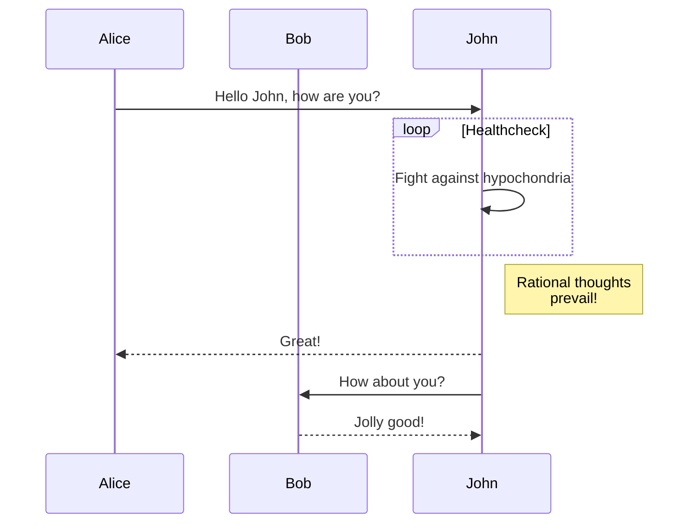

+++
title = "Шорткодове"
date = 2022-10-20
updated = 2024-10-24
description = "Шорткодовете на темата Линкита."
[taxonomies]
tags = ["маркдаун", "css", "html"]
[extra]
mermaid = true
+++

Темата Линкита предоставя множество шорткодове.

Ако не сте чували за шорткодове, вижте [документацията на Зола](https://www.getzola.org/documentation/content/shortcodes/) за повече информация.

## Mermaid

За да използвате Mermaid във вашата страница, трябва да зададете `extra.mermaid = true` в предните данни (frontmatter) на страницата.

```markdown
+++
title = "Заглавие на вашата страница"

[extra]
mermaid = true
+++
```

След това можете да използвате шорткодовете `mermaid()` ето така:

```markdown


graph TD;
A-->B;
A-->C;
B-->D;
C-->D;


```

Това ще бъде изобразено така:



graph TD;
A-->B;
A-->C;
B-->D;
C-->D;



Освен това, можете да използвате блок с код вътре в шорткодовете `mermaid()` и блокът с код ще бъде игнориран.

Блокът с код предотвратява форматирането на Mermaid от форматиращия инструмент.

````markdown





````

Това ще бъде изобразено така:






## Предупреждение

Шорткодът `admonition()` показва банер, който ви помага да поставите известие на вашата страница.

Можете да използвате шорткодът `admonition()` по този начин:

```markdown

Предупреждението `tip`.

```

Шорткодът `admonition` има 12 различни типа:


Предупреждението `note`.



Предупреждението `abstract`.



Предупреждението `info`.



Предупреждението `tip`.



Предупреждението `success`.



Предупреждението `question`.



Предупреждението `warning`.



Предупреждението `failure`.



Предупреждението `danger`.



Предупреждението `bug`.



Предупреждението `example`.



Предупреждението `quote`.


## Галерия

Шорткодът `gallery()` е много проста, само с HTML, галерия с изображения, която показва всички изображения от „assets“ на страницата.

Взето е от [документацията на Зола](https://www.getzola.org/documentation/content/image-processing/)

```markdown
{{/* gallery() */}}
```

{{ gallery() }}
```
